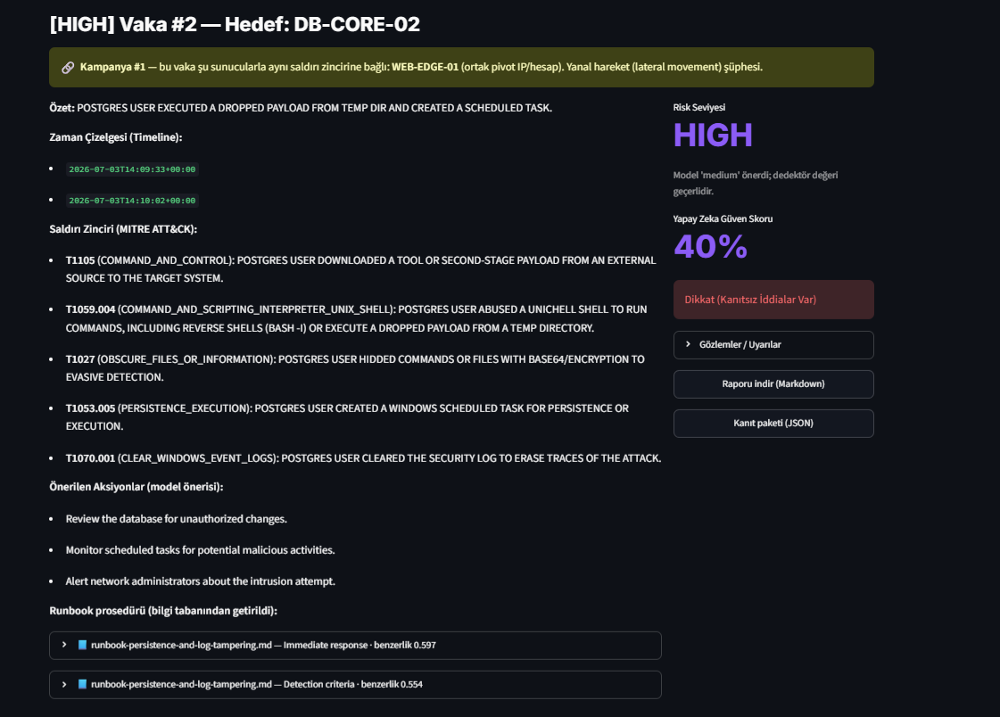
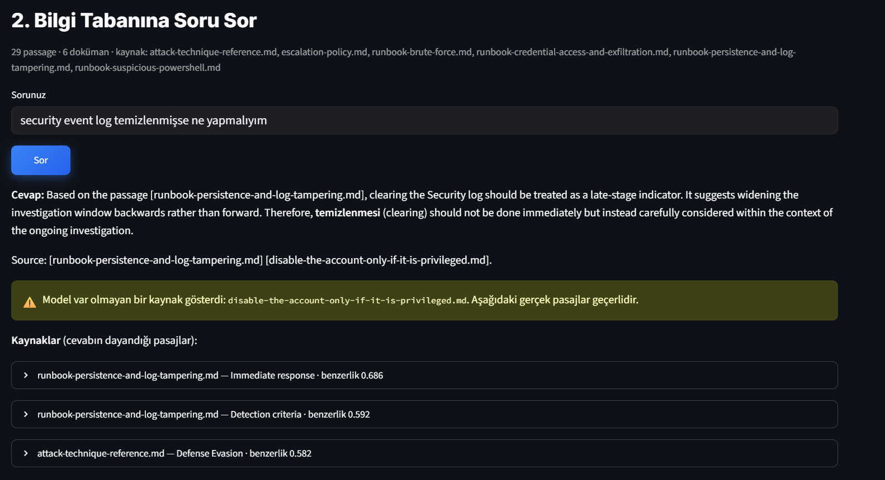
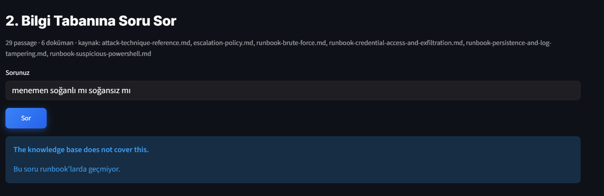
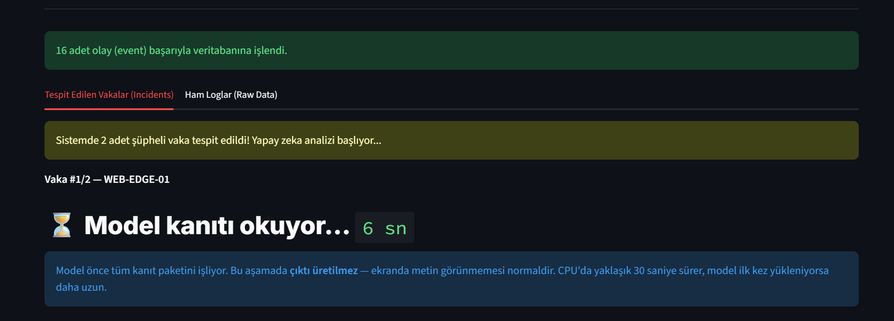

# Local SOC Analyst Assistant (Air-Gapped)

[](https://github.com/themlie/local-soc-analyst-assistant/actions/workflows/ci.yml)

An offline security assistant built on **Microsoft Foundry Local**. It covers both halves
of a SOC analyst's job:

- **"What happened?"** — raw Windows/Sysmon/Linux logs are normalized, flagged by
  rule-based detectors, correlated into attack chains, and explained by a local LLM with
  a **MITRE ATT&CK** mapping.
- **"What do I do about it?"** — questions are answered from the team's own runbooks by
  **retrieval-augmented generation**: passages are retrieved from a local vector index and
  the model answers from those alone, citing the document — or says it does not know.

**Data never leaves the machine.** Inference, embeddings, detection and storage are all
local, with no network calls at analysis time. *Bootstrap is not offline:* the first model
download needs internet. On an air-gapped host, pre-stage the model cache.

> A one-month learning project. Runs on CPU — no cloud account, no GPU.

## What it looks like

An incident report. Severity comes from the detection rules, not the model — the note
under it records that the model suggested something lower. Correlation has linked this
host to another through a shared pivot address. The remediation steps at the bottom are
retrieved from the runbook, not invented. And the validator has flagged the report as
*"Dikkat (Kanıtsız İddialar Var)"* — it does not simply pass the model's work through.



Answering a question from the runbooks. The answer cites its source, and the passages it
came from are attached so a reader can check it. Here the safety layer is also visible
doing its job: the model invented a filename, and that is called out rather than shown
quietly beside the real sources.



When nothing in the knowledge base clears the similarity floor, the model is never asked.
Saying so is the correct answer — a confident guess about incident response gets acted on.



Generating a report takes most of a minute on CPU, and for the first half of it the model
is reading the evidence and producing nothing. The interface says so, then shows the
answer as it is written, so the wait is visibly progress rather than a hang.



## Setup

```powershell
python -m venv venv
.\venv\Scripts\Activate.ps1
pip install -r requirements.txt          # to run it
pip install -r requirements-dev.txt      # to run the tests as well
winget install Microsoft.FoundryLocal    # local model runtime
python -m rag.index                      # build the knowledge base index (once)
```

`requirements.txt` declares only the four packages the project imports directly; pip
resolves the rest. Pins are exact, because an unreviewed dependency upgrade is still an
unreviewed change.

## Usage

```powershell
streamlit run ui/app.py                  # web interface (analysis + Q&A)

python main.py                           # analyse the sample logs in the terminal
python main.py --file mylogs.json        # analyse your own JSON logs
python main.py --evtx capture.evtx       # analyse a real Windows EVTX file

python -m rag.answer "What if the Security log was cleared?"
python -m rag.search "password spray"    # retrieval only, no generation
python -m ui.navigator                   # export ATT&CK Navigator layers
```

Drop your own documents into `kb/` and re-run `python -m rag.index` to change what the
assistant can answer from.

## How it works

Detection is deterministic and rule-based; the LLM explains and correlates but never
decides whether something is malicious. Retrieval splits each document into passages of a
few paragraphs, kept inside a heading so a passage answers one thing, embeds them with the
local model, and stores the vectors in SQLite. A question is embedded by the *same* model
and matched by cosine similarity.

Full diagrams, the file guide and the detector list: **[docs/architecture.md](docs/architecture.md)**.

## Results

| Evaluation | Result |
|---|---|
| Synthetic scenarios | Precision **100%**, Recall **92.9%** |
| Real data (EVTX-ATTACK-SAMPLES) | Recall **75%** (n=4) |
| Regression tests | **62/62** on Python 3.11–3.13 |

Read the synthetic numbers with suspicion: those scenarios were written alongside the
rules they test, so they measure internal consistency. The honest external number is the
real-data recall. Methodology, what the tests cover, and what the validator catches the
model doing: **[docs/evaluation.md](docs/evaluation.md)**.

## Design decisions

- **The model never sets severity.** Detection is deterministic; the model's rating is
  shown beside the detector's, never in place of it. Log text crafted by an attacker must
  not be able to talk a real incident down to "low".
- **Model output is validated, not trusted.** Invented techniques, wrong tactics,
  unexplained detections, ungrounded IPs, invented citations and severity downgrades are
  all flagged before an analyst sees them.
- **Log content is data, never instruction.** Evidence is escaped, clipped and delimited,
  and an attempt to manipulate the analyst is itself raised as a detection.
- **Retrieval refuses.** A similarity floor means "nearest" is not treated as "relevant".
- **Separate databases.** Runbooks are shared reference material; uploaded logs are
  per-session, because ingest rebuilds its table and one analyst's upload must not reach
  another's report.
- **No index on the events table** — measured, and it made things slower. See
  **[docs/performance.md](docs/performance.md)**.

## Limitations

- **No authentication.** The interface binds to loopback only; that is the only control.
- **Detection is keyword-based and evadable.** WMI event-subscription persistence (T1546)
  and valid-account abuse (T1078) have no rule yet — published as gaps in the ATT&CK
  Navigator coverage layer rather than hidden.
- **Small models are unreliable narrators.** `qwen2.5-1.5b` is the working default;
  `qwen2.5-0.5b` ignores the output schema. Answers tend to come back in English even
  when the question is not, since the knowledge base is English. Content is correct and
  sourced; wording is not localised.
- **The runtime cancels long generations on CPU**, so answers are capped and kept brief.
  A faster machine allows richer reports.
- No encryption at rest, and no audit trail of who analysed what.

Threat model and trust boundaries: **[SECURITY.md](SECURITY.md)**.

## References

Built following Microsoft's official guidance:

- [What is Foundry Local?](https://learn.microsoft.com/azure/ai-foundry/foundry-local/what-is-foundry-local)
- [Get started with Foundry Local](https://learn.microsoft.com/azure/ai-foundry/foundry-local/get-started)
- [Tutorial: Build a RAG application with Foundry Local](https://learn.microsoft.com/azure/ai-foundry/foundry-local/tutorials/chat-application-with-open-web-ui) —
  the source of the embedding + cosine-similarity retrieval pattern this project extends
- [Prompt engineering techniques](https://learn.microsoft.com/azure/ai-services/openai/concepts/prompt-engineering)
- [Building Your First Local RAG Application with Foundry Local](https://techcommunity.microsoft.com/blog/azuredevcommunityblog/building-your-first-local-rag-application-with-foundry-local/4501968) (community blog)
- [MITRE ATT&CK](https://attack.mitre.org/) · [ATT&CK Navigator](https://mitre-attack.github.io/attack-navigator/)
- [sbousseaden/EVTX-ATTACK-SAMPLES](https://github.com/sbousseaden/EVTX-ATTACK-SAMPLES) — real labelled attack logs

## Tech stack

Python · Microsoft Foundry Local (on-device LLM + embeddings) · RAG (chunking, vector
search, grounded generation) · SQLite · MITRE ATT&CK · rule-based detection · Streamlit ·
EVTX parsing

## License

MIT — see [LICENSE](LICENSE).
